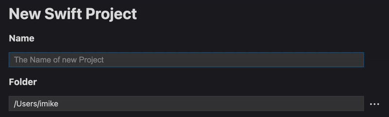
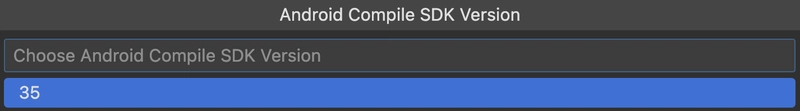

# Getting Started with an App

As you already [→ setup](../setup/index.md) your development environment, it's time to create the project.

On the left sidebar in VSCode, click the Swift Stream icon (the bird).

and hit **Start New Project**

Now, enter your project name, for example, `MyAndroidApp`.

You'll see that the new project will be created in your home folder by default.

!!! tip
    You can choose a different folder by clicking the three-dots button.

The next step is to choose **`Android -> Application`** project type.

Click **Create Project**

Next, enter the Java namespace for your app. This is usually your domain name in reverse (e.g., `com.example.myapp`).

After entering the namespace, hit Enter to move to the next step, where you'll choose the `Android Min SDK Version`.

The best choice is **28**, to support the widest range of devices, hit `Enter`.

!!! note
    The official Swift for Android SDK supports SDKs from **28** to **35**.

Next choose the `Android Compile SDK Version`.

Choose **35** and hit `Enter` one more time to start the project creation process.

At this point, VSCode will create a folder with all the project files and begin downloading the Docker image with a ready-to-use Android development environment.

Once the image is downloaded, it will start the container and open a new VSCode window with your project inside it. The container will then download the Swift toolchain, Swift for Android SDK, Gradle, Android NDK, and Android SDK.
!!! note
    These tools are cached on shared Docker volumes, so your next project will be created in seconds.

However, this first launch might take some time, so please be patient.

!!! warning
    If you see a popup saying that the Swift toolchain is not found, please wait for several minutes until the toolchain is fully downloaded inside the container. This popup is from the official Swift extension for VSCode, and it cannot detect the toolchain while it's being downloaded.

Please wait until you see the following:

And you're all set! Ready to write some code!

!!! danger "Important"
    If you seen the popup about missing Swift toolchain, then once everything is ready, please hit **Ctrl/Cmd+Shift+P** and choose **Reload Window** to make the Swift extension detect the toolchain.
