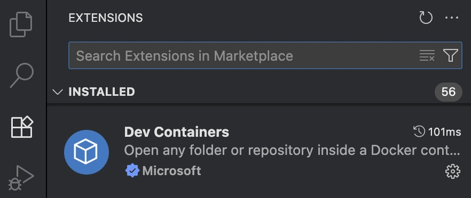
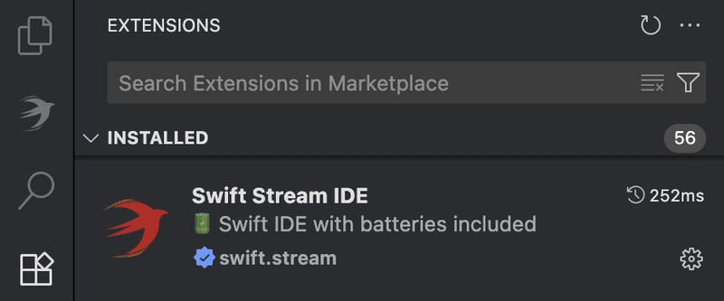

# Setup on macOS

## Docker

Install Docker Desktop for Mac by following the instructions from [here](https://docs.docker.com/desktop/setup/install/mac-install/).

> Docker Desktop is supported on the current and two previous major macOS releases. As new major versions of macOS are made generally available, Docker stops supporting the oldest version and supports the newest version of macOS (in addition to the previous two releases).

## VSCode

Download and install Visual Studio Code from [here](https://code.visualstudio.com/download).

Once installed, open VSCode and head to extensions tab (⇧⌘X) to install the following extensions:

[Dev Containers](https://marketplace.visualstudio.com/items?itemName=ms-vscode-remote.remote-containers)

> When you try to create your first project, the Dev Containers extension may ask to download additional Docker components, even though Docker is already installed. Allow it to do so.

[Swift Stream IDE](https://marketplace.visualstudio.com/items?itemName=swiftstream.swiftstream)

Aaaaaand... you are all set!

Now check out our [→ Application](../app/index.md) and [→ Library](../lib/index.md) guides.